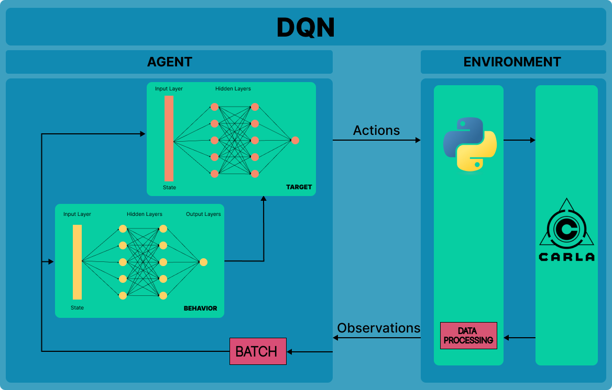

# QDriveSim: Autonomous Driving using Deep Q-Learning in CARLA Simulator Environment
Questo lavoro esplora l'uso di reti neurali binarie *(BNN)* per migliorare l'efficienza dell'addestramento delle reti neurali nel contesto della guida autonoma. Abbiamo sviluppato un sistema basato su *Deep Q-Network (DQN)* e lo abbiamo testato nel simulatore CARLA con diverse configurazioni di sensori e ambienti.

## Requisiti

### Software: 
- Python: 3.8
- CARLA: 0.9.15
- Librerie: installare da `requirements.txt`

### Requisiti di sistema: 
- GPU: il server necessita di una GPU di almeno 6 GB, anche se 8 GB è raccomandata. È altamente raccomandata una GPU dedicata per il machine learning.
- RAM: almeno 16 o 32 GB.
- Sistema x64: il simulatore dovrebbe funzionare su qualsiasi sistema Windows a 64 bit.
- 165 GB di spazio su disco. CARLA occuperà circa 32 GB e le principali installazioni di software correlate (incluso Unreal Engine) occuperanno circa 133 GB.

### Installazioni minori
- **CMake** genera file di build standard da semplici file di configurazione. Si raccomanda di utilizzare la versione 3.15+.
- **Make** genera gli eseguibili. È necessario utilizzare la versione 3.81 di Make, altrimenti la build potrebbe fallire. Se si hanno più versioni di Make installate, verificare di utilizzare la versione 3.81 nel proprio PATH durante la build di CARLA. È possibile verificare la versione predefinita di Make eseguendo make --version.
- **7Zip** è un software di compressione file. È necessario per la decompressione automatica dei file di asset e previene errori durante il tempo di build a causa di file grandi estratti in modo errato o parziale.
- **pip** versione 20.3 o superiore è richiesta.

## Installazione

Prima di eseguire qualsiasi codice da questo repository, è necessario:
1. **Clonare questo repository**: `git clone https://github.com/a-ture/QDriveSim`
2. **Scaricare CARLA 0.9.15** dal loro repository GitHub, [qui](https://github.com/carla-simulator/carla/releases/tag/0.9.15/) dove è possibile trovare i binari precompilati pronti per l'uso. Fare riferimento a [carla-quickstart](https://carla.readthedocs.io/en/latest/start_quickstart/) per ulteriori informazioni.
3. **Installare i binding Python di CARLA** per poter gestire CARLA dal codice Python. Assicurarsi di utilizzare un ambiente virtuale Anaconda, aprire il terminale e digitare:
```sh
 pip3 install carla
```

4. Prima di eseguire il codice del repository, assicurarsi di avviare prima CARLA:
- Windows: your-path-to/CARLA_0.9.15/WindowsNoEditor/CarlaUE4.exe
- Linux: your-path-to/CARLA_0.9.15/./CarlaUE4.sh
- [optional] To use less resources add these flags to the previous command: -windowed -ResX=32 -ResY=32 --quality-level=Low. For example ./CarlaUE4.sh --quality-level=Low.

## Architettura del Progetto

L'architettura del progetto  è la seguente:

- **Environment:** Il simulatore CARLA fornisce un ambiente realistico in cui il veicolo autonomo può operare.
- **Agent:** L'agente è il modello di rete neurale addestrato per prendere decisioni di guida.
- **Actions:** L'agente può eseguire diverse azioni di guida, come accelerare, frenare e sterzare.
- **Observations:** L'agente riceve osservazioni dall'ambiente attraverso sensori come telecamere RGB, sensori di profondità e segmentazione.
- **Data Processing:** I dati raccolti dai sensori vengono preprocessati e convertiti in un formato adatto per l'addestramento del modello.
- **Batch:** I dati preprocessati vengono organizzati in batch per l'addestramento del modello.
- **State:** Lo stato dell'agente include tutte le informazioni necessarie per prendere decisioni informate.
- **Behavior:** Il comportamento dell'agente emerge dalle azioni prese in risposta agli stati osservati.
- **Target:** La rete target viene utilizzata per stabilizzare l'addestramento del modello, aggiornando i pesi periodicamente.

## Organizzazione delle Cartelle
- **TestRequirements:** Include tutti i requisiti software necessari per riprodurre il progetto. 
- **Documents:**  Contiene tutta la documentazione e i lavori correlati che sono stati considerati nello sviluppo del progetto. Questa cartella include articoli di ricerca, riferimenti bibliografici, e altre risorse utili per comprendere il contesto e il background teorico del progetto..
- **QDriveSim_Brake_Throttle_Steer:**  Contiene un'architettura basata su CNN che produce in output i valori di *steer* (sterzata), *throttle*(accelerazione) e *brake* (frenata). Questa cartella include gli script e i modelli utilizzati per addestrare e valutare questa configurazione specifica.
- **QDriveSim_Throttle_Steer:** Contiene un'architettura basata su CNN che produce in output i valori di *steer*  e *throttle*. Questa cartella include gli script e i modelli per l'addestramento e la valutazione di questa configurazione. 
- **QDriveSim_Steer:** Contiene un'architettura basata su CNN che produce in output il valore di *steer*. Questa cartella include gli script e i modelli per l'addestramento e la valutazione di questa configurazione. Inoltre, qui sono presenti le versioni binarizzate di questa architettura, implementate in tre modi diversi: binarizzazione dei soli layer convoluzionali, binarizzazione completa (i layer convuluzionali, le funzioni ReLU e di perdita), e binarizzazione dei pesi della rete già addestrata. Queste versioni binarizzate mirano a migliorare l'efficienza computazionale mantenendo buone prestazioni di guida. 
   
## Guida all'Utilizzo 

Per utilizzare il progetto, seguire questi passaggi:

1. **Preparazione dell'ambiente:**
   - Assicurarsi che il simulatore CARLA sia avviato come descritto nella sezione di installazione. È possibile avviarlo utilizzando i seguenti comandi:
     - Windows: `your-path-to/CARLA_0.9.15/WindowsNoEditor/CarlaUE4.exe`
     - Linux: `your-path-to/CARLA_0.9.15/./CarlaUE4.sh`
     - [opzionale] Per utilizzare meno risorse, aggiungere questi flag: `-windowed -ResX=32 -ResY=32 --quality-level=Low`.
   - Lanciare il file `initial_setup.py` per completare la configurazione iniziale:
     ```sh
     python initial_setup.py
     ```

2. **Selezione del progetto:**
   - Selezionare l'architettura da utilizzare per l'addestramento. Ad esempio, se si vuole utilizzare l'architettura **QDriveSim_Steer**, procedere come segue:
     - **Addestramento della rete non binaria:** Eseguire lo script `train.py` per avviare l'addestramento della rete non binaria:
       ```sh
       python QDriveSim_Steer/train.py
       ```
     - **Addestramento della rete binaria:** Eseguire lo script `train_binary.py` per avviare l'addestramento della rete nella configurazione con layer convoluzionali binari o nella configurazione completamente binarizzata:
       ```sh
       python QDriveSim_Steer/train_binary.py
       ```
     - **Valutazione del modello:** Eseguire lo script `main.py` per valutare il modello addestrato nelle diverse configurazioni (layer binari, layer binari con ReLU e funzione di perdita binarizzati, o nella forma non binarizzata):
       ```sh
       python QDriveSim_Steer/main.py
       ```
     - **Valutazione del modello con pesi binarizzati:** Eseguire lo script `main_weights_binary.py` per valutare il modello addestrato con i pesi binarizzati:
       ```sh
       python QDriveSim_Steer/main_weights_binary.py
       ```


3. **Analisi dei risultati:**
   - I risultati dell'addestramento e della valutazione verranno salvati in file di log e file CSV.
     - **Metriche di CARLA:** I risultati dettagliati delle metriche di CARLA verranno salvati nel file `episode_metrics.csv`.
     - **Metriche di CodeCarbon:** Le metriche relative al consumo energetico, raccolte da CodeCarbon, verranno salvate nel file `emission.csv`.

## Risultati
I dettagli specifici per ogni architettura possono essere trovati nelle seguenti cartelle:

- **QDriveSim_Brake_Throttle_Steer:** Include i risultati dell'architettura basata su CNN che produce in output i valori di *steer*, *throttle* e *brake*.
- **QDriveSim_Throttle_Steer:** Include i risultati dell'architettura basata su CNN che produce in output i valori di *steer* e *throttle*.
- **QDriveSim_Steer:** Include i risultati dell'architettura basata su CNN che produce in output il valore di *steer*. Questa cartella contiene anche le versioni binarizzate dell'architettura, implementate in tre modi diversi: binarizzazione dei soli layer convoluzionali, binarizzazione completa (inclusi i layer convoluzionali, le funzioni ReLU e di perdita), e binarizzazione dei pesi della rete già addestrata.

### Configurazione hardware
Gli esperimenti sono stati eseguiti su un sistema con la seguente configurazione hardware:

- **CPU:** *Ryzen 5 7600* (Potenza 42.5 W).
- **GPU:** *NVIDIA GeForce RTX 4060Ti* con 16 GB di RAM dedicata (Potenza 50.078 W).
- **RAM:** *32 GB* (Potenza 11.67 W).

## Contributors 
<a href="https://github.com/raffaellaspagnuolo/WoodLot/graphs/contributors">
  
</a>

